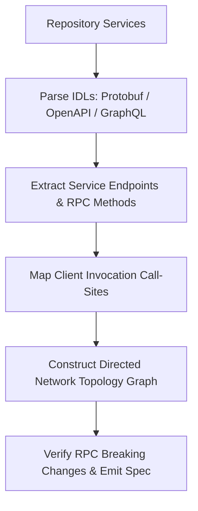

# 🕸️ Strata

**Cross-Service, RPC & Microservice Topology Tracer.** Strata maps communication topologies across distributed microservices by statically analyzing interface definition files (IDLs) and API contracts without running the live infrastructure.

## 🎯 Golden Rules
1. **Static contract extraction**: Parse `.proto`, `openapi.yaml`, `schema.graphql`, and HTTP client call-sites directly from source.
2. **Detect breaking RPC changes**: Compare protobuf field IDs, wire types, and endpoint signatures across service repositories.
3. **Map network call-graphs**: Construct directed adjacency graphs representing inter-service RPC / HTTP requests and message topic pub/sub.

## 🏗️ Architecture & Pipeline



## 🚀 Usage Guide

### 1. Run Microservice Topology Extraction
```bash
node C:/Users/GdC/.gemini/config/skills/strata/lib/strata.js --dir "./services"
```

### 2. Output
Generates `strata-topology.md` containing:
* Microservice Call Graph Diagram (Mermaid)
* Endpoints & RPC Contract Matrix
* Breaking Change & Compatibility Verdict
